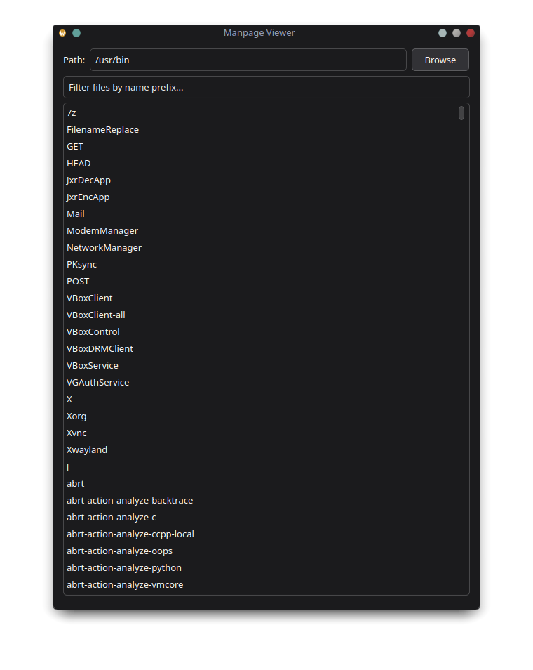
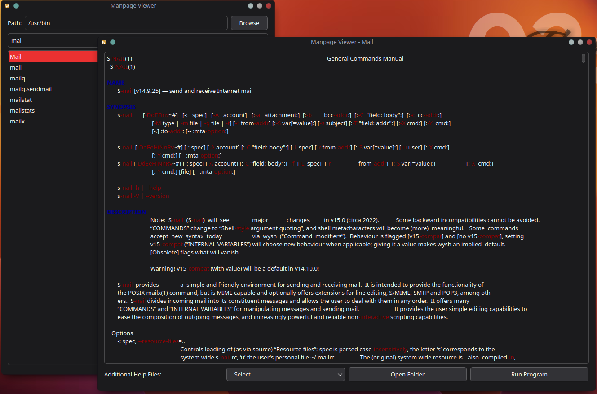

# Manpage Viewer

A simple Manpage Viewer built with Python and PyQt6.

## Features

- Browse executable programs in a chosen directory (default: `/usr/bin`)
- Double-click a program to display its manpage with syntax highlighting
- If no manpage is found, a friendly message is shown
- Additional help files related to the program (e.g. README, `.txt`, `.md`) are listed in a dropdown for easy access
- Open the program's folder directly in the file manager
- Run the selected program in a terminal with a single click

### Screenshots

| Main Window                     | Manpage Window                          |
|--------------------------------|---------------------------------------|
|  |  |

## Requirements

- Python 3.8 or higher
- PyQt6

## Installation

1. Just save the file
