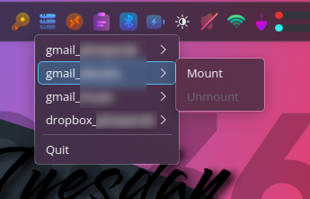

# pkrclonegui

A lightweight system tray application for managing your **rclone** mounts via systemd user services.

<p align="center">
  
  
</p>

## 📖 Description

`pkrclonegui` is a small Python-based system tray tool that detects your configured `rclone` remotes and allows you to **mount** or **unmount** them via `systemd --user` services. It provides a simple and clean menu accessible from the system tray and is ideal for desktop users who use `rclone` regularly.

## ✨ Features

- 🧠 Automatically detects remotes listed in your `~/.config/rclone/rclone.conf`
- ⚙️ Integrates with `systemctl --user` using templated services like `rclone@<remote>.service`
- 🎛️ System tray menu with per-remote `Mount` / `Unmount` actions
- ⛔ Only offers valid actions based on the service state (e.g. disables "Mount" if already mounted)
- 🔁 Periodically refreshes the state every 10 seconds
- 💡 Lightweight, no window stays open

## 📦 Requirements

- Python 3.10+
- PyQt6
- `rclone` installed and configured
- A valid user-level systemd environment
- `rclone@.service` must be set up for each remote (see below)

## 🛠️ Installation

```bash
git clone https://github.com/youruser/pkrclonegui.git
cd pkrclonegui
pip install -r requirements.txt  # if you have one
python3 pkrclonegui.py
```

Or make it executable and run directly:

```bash
chmod +x pkrclonegui.py
./pkrclonegui.py
```

## 🧩 systemd service setup

Create a template service unit (once per user):

```bash
mkdir -p ~/.config/systemd/user
```

Then save this as `~/.config/systemd/user/rclone@.service`:

```ini
[Unit]
Description=Mount Rclone remote %i
After=network-online.target

[Service]
Type=simple
ExecStart=/usr/bin/rclone mount %i: /mnt/%i --vfs-cache-mode writes
ExecStop=/bin/fusermount -u /mnt/%i
Restart=on-failure

[Install]
WantedBy=default.target
```

Create your mount points:

```bash
mkdir -p ~/mnt/myremote  # for each remote
```

Enable the service if desired:

```bash
systemctl --user enable rclone@myremote
```

> Replace `myremote` with the actual remote name in your `rclone.conf`.

## 🚀 Usage

Just run the application:

```bash
python3 pkrclonegui.py
```

An icon will appear in your system tray. Click it to view your `rclone` remotes and mount/unmount them easily.

## 🖥️ Create Desktop Entry

To integrate `pkrclonegui` into your desktop environment’s application menu under the "Internet" category, you can use the following script to create a `.desktop` file:

`create_pkrclonegui_desktop.sh`, make it executable (`chmod +x create_pkrclonegui_desktop.sh`), and run it.

## 📷 Screenshot

| Main Window                     |
|--------------------------------|
|  |

## 📝 License

This project is licensed under the MIT License.
2025 by Peter Kasparak <peter.kasparak@gmail.com>
